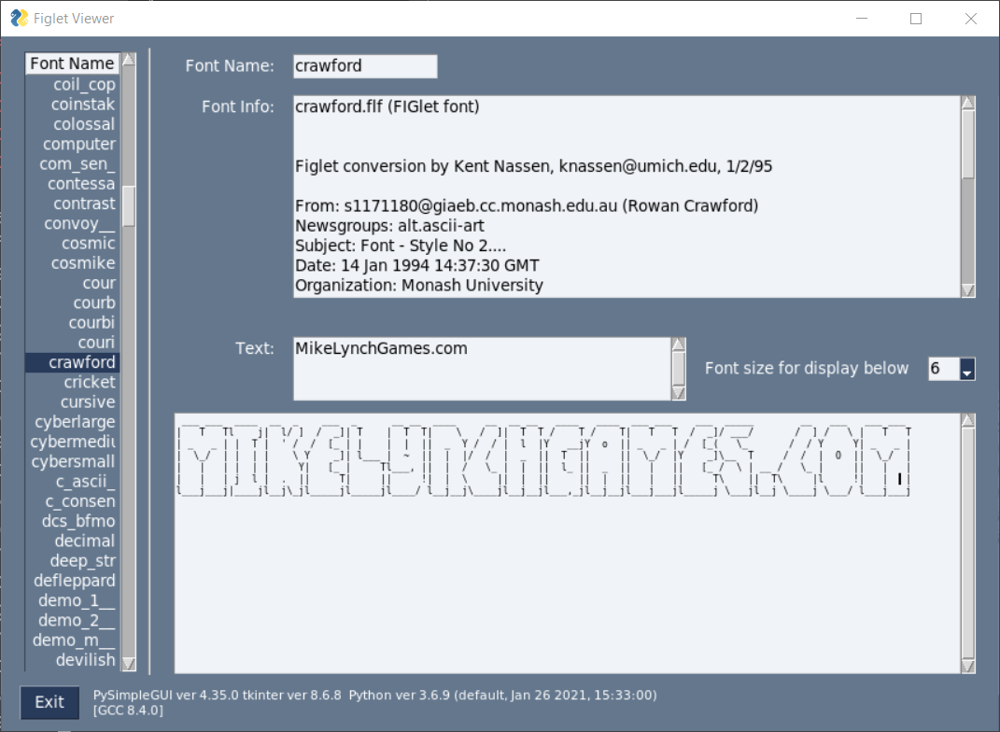

```
#      _______ _______ _______ ___ ___      _______ _______ ______  _______ 
#     |   _   |   _   |   _   |   |   |    |   _   |   _   |   _  \|       |
#     |.  1   |   1___|.  1___|.  |.  |    |.  1___|.  |   |.  |   |.|   | |
#     |.  _   |____   |.  |___|.  |.  |    |.  __) |.  |   |.  |   `-|.  |-'      
#  ___|:  |   |:  1   |:  1   |:  |:  |____|:  |   |:  1   |:  |   | |:  |____        
# |  _|::.|:. |::.. . |::.. . |::.|::.|____|::.|   |::.. . |::.|   | |::.|__  |       
# | |  `--- ---`-------`-------`---`---`    `---`   `-------`--- ---` `---' | |       
# | |               ___ ___ ___ _______ ___ ___ _______ _______             | |
# | |______________|   Y   |   |   _   |   Y   |   _   |   _   \____________| |
# |________________|.  |   |.  |.  1___|.  |   |.  1___|.  l   /______________|
#                  |.  |   |.  |.  __)_|. / \  |.  __)_|.  _   1
#                  |:  1   |:  |:  1   |:      |:  1   |:  |   |
#                   \:.. ./|::.|::.. . |::.|:. |::.. . |::.|:. |
#                    `---' `---`-------`--- ---`-------`--- ---'
#                       
# ascii-font-processor
```

This is a project for vieweing figlet formatted fonts.  It reads a folder full of 
fonts, and then allows them to be editor and viewed. 



# What is it?

I found http://www.jave.de/figlet/figfont.html.  Using [pyfiglet](https://www.geeksforgeeks.org/python-ascii-art-using-pyfiglet-module/) this reads figlet style fonts and using PySimpleGUI it displays the fonts and allows you to enter text and view how that font represents it.  You can copy and paste that output also. 

The longer term plan for this project is to create a fontbook manager that can package up the fonts into a zip for use on a website or within a project.

## Fonts

Fonts are found how figlet finds them, you may already have fonts installed on your machine, or it will search in the fonts folder int he folder it is launched in.

more fonts can be found here: https://github.com/pwaller/pyfiglet/tree/master/pyfiglet/fonts 

## Future Work

* This project was pivoted from another, so the input directory is not used currently.
* The metadata is not individually selectable from the pyFiglet library. A PR there, and then changes here would show the meta data. Each individual attribute needs to be pulled out so it can be viewed.
* There is no way to modify the fonts, or create a font, yet.


